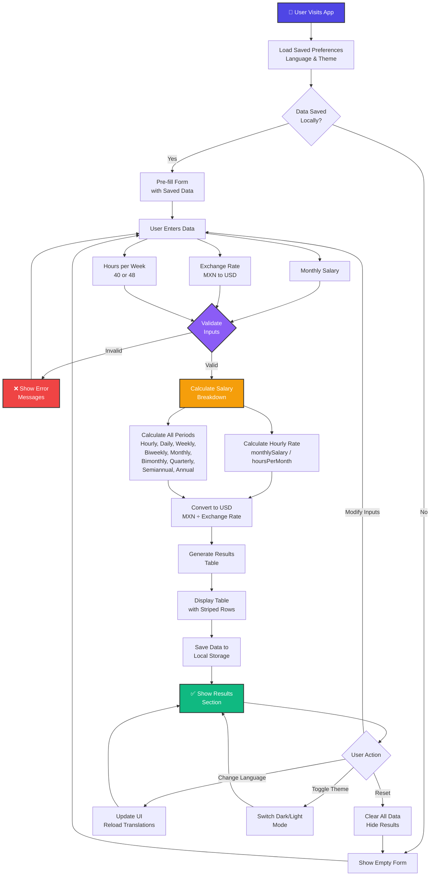

# Calculadora de Salario / Salary Calculator

A bilingual salary calculator that converts monthly salary to hourly, daily, weekly, and annual rates in both MXN and USD.


## Table of Contents
- [Features](#features)
- [Usage](#usage)
- [Application Flow](#application-flow)
- [Calculation Formula](#calculation-formula)
- [Project Structure](#project-structure)
- [Development](#development)
- [Contributing](#contributing)


## ✨ Features
🌍 **Bilingual** (Spanish/English) | 🌙 **Dark/Light mode** | 📱 **Mobile responsive**  
💾 **Auto-save** | 📊 **9 salary periods** | ⚡ **No dependencies** | 🎯 **Offline capable**


## Usage
Visit: https://frantizek.github.io/salary-calculator/

Or:

Clone the repo
Open `index.html` in browser
Enter your salary and exchange rate
Click Calculate


## Application Flow




## Salary Periods
- Hourly (Por Hora)
- Daily (Por Día)
- Weekly (Semanal)
- Biweekly (Quincenal)
- Monthly (Mensual)
- Bimonthly (Bimestral)
- Quarterly (Trimestral)
- Semiannual (Semestral)
- Annual (Anual)


## Calculation Formula

### Hourly Rate
```text
Hourly Rate (MXN) = Monthly Salary ÷ (Hours per Week × 4.33)
Hourly Rate (USD) = Hourly Rate (MXN) ÷ Exchange Rate
```

### Other Periods
```
Daily Rate = Hourly Rate × 8 hours
Weekly Rate = Hourly Rate × Hours per Week
Biweekly = Monthly Salary ÷ 2
Monthly = Base Input
Bimonthly = Monthly Salary × 2
Quarterly = Monthly Salary × 3
Semiannual = Monthly Salary × 6
Annual = Monthly Salary × 12
```


## Project Structure
```
salary-calculator/
├── index.html      # Main HTML file
├── css/
│ └── style.css     # Styles (light & dark themes)
├── js/
│ ├── i18n.js       # Translation manager
│ └── script.js     # Main application logic
├── locales/
│ ├── es.json       # Spanish translations
│ └── en.json       # English translations
├── README.md       # This file
└── .gitignore      # Git ignore rules
```


## Technologies
* **HTML5** - Semantic markup
* **CSS3** - Custom Properties (CSS Variables) for theming
* **Vanilla JavaScript** - No frameworks or dependencies
* **Local Storage API** - Persistent data storage
* **i18n System** - Custom translation manager


## Browser Support
* Chrome/Edge 90+
* Firefox 88+
* Safari 14+
* Mobile browsers (iOS Safari, Chrome Mobile)


## Internationalization (i18n)
The app supports multiple languages through JSON translation files:

### Spanish (es.json)
```json
{
"title": "Calculadora de Salario",
"labels": {
"monthlySalary": "Salario Mensual Bruto (MXN)",
"exchangeRate": "Tipo de Cambio (1 USD = ? MXN)"
}
}
```

### English (en.json)
```json
{
"title": "Salary Calculator",
"labels": {
"monthlySalary": "Gross Monthly Salary (MXN)",
"exchangeRate": "Exchange Rate (1 USD = ? MXN)"
}
}
```

### Adding a New Language
1. Create `locales/[lang-code].json` 
2. Add all translation keys
3. Add option to language select in `index.html`
4. Reload app


## Theme System
The app uses CSS Custom Properties for theme switching:

### Light Mode (Default)
```css
--color-bg: #f8f9fa;
--color-surface: #ffffff;
--color-text: #1f2937;
--color-primary: #2563eb;
```

### Dark Mode
```css
--color-bg: #1a1a1a;
--color-surface: #2d2d2d;
--color-text: #f3f4f6;
--color-primary: #60a5fa;
```

Toggle with button or programmatically:
```javascript
document.documentElement.setAttribute(`data-theme`, `dark`);
```


## Local Storage
The app persists:

* `language` - Selected language (es/en)
* `theme` - Selected theme (light/dark)
* `calculatorData` - Last entered values

```javascript
// Clear all stored data
localStorage.clear();

// Clear specific item
localStorage.removeItem(`calculatorData`);
```


## Features Breakdown
### Input Validation
- ✅ Salary must be > 0
- ✅ Exchange rate must be > 0
- ✅ Clear error messages in selected language
- ✅ Prevents invalid calculations

### Results Table
- ✅ 9 salary periods
- ✅ Both MXN and USD columns
- ✅ Striped rows for readability
- ✅ Hover effects
- ✅ Responsive on mobile

### User Experience
- ✅ Enter key triggers calculation
- ✅ Auto-save form data
- ✅ Smooth scrolling to results
- ✅ Reset button clears everything
- ✅ Language changes update entire UI


## Development
### Prerequisites
* GitHub account
* Codespaces (free tier)
* Modern web browser

### Quick Start

```bash

Clone repository
git clone https://github.com/frantizek/salary-calculator.git
cd salary-calculator

Open in Codespaces
Or simply open index.html in browser
```

## Making Changes
1. Edit files in Codespaces
2. Files auto-save
3. Test in browser
4. Commit changes
5. Push to GitHub
6. GitHub Pages auto-deploys
```bash
git add .
git commit -m "Description of changes"
git push origin main
```

## Performance
* **Bundle Size:** < 50 KB (HTML + CSS + JS combined)
* **Load Time:** < 1 second
* **No external dependencies:** Pure vanilla stack
* **Offline Capable:** Works without internet after first load

## Accessibility
- ✅ Semantic HTML5 elements
- ✅ ARIA labels on buttons
- ✅ Keyboard navigation support
- ✅ Color contrast compliant
- ✅ Mobile touch targets (44×44px minimum)

## Future Enhancements
- [ ] Add more currency pairs
- [ ] Export results to PDF
- [ ] Copy to clipboard functionality
- [ ] Tax calculations option
- [ ] Historical exchange rates
- [ ] Multi-currency comparison
- [ ] PWA support (offline + mobile app)

## License
MIT License - Feel free to use, modify, and distribute

## Author
Created with ❤️ for freelancers and contractors in Mexico

## Contributing
Found a bug or have a suggestion?

1. Create an issue on GitHub
2. Fork the repository
3. Create a pull request

Let's improve it together!

## Example Usage

### Input:

- Monthly Salary: $105,000 MXN
- Exchange Rate: 18.48 MXN/USD
- Hours/Week: 40

### Output:

| Period | MXN | USD |
|--------|----:|----:|
| Hourly | $656.25 | $35.51 |
| Daily | $3,500.00 | $189.39 |
| Weekly | $24,165.71 | $1,307.67 |
| Monthly | $105,000.00 | $5,681.82 |
| Annual | $1,260,000.00 | $68,181.82 |

Last Updated: October 2025
Version: 1.0.0